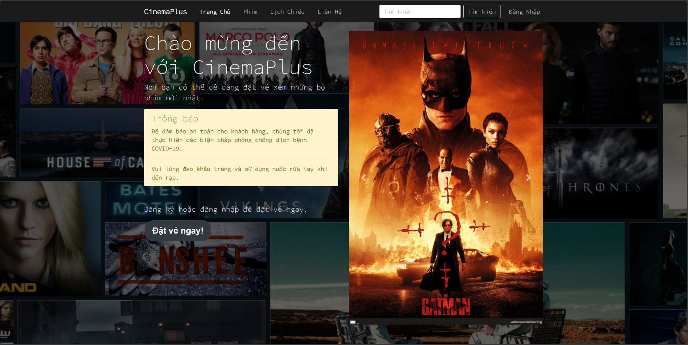
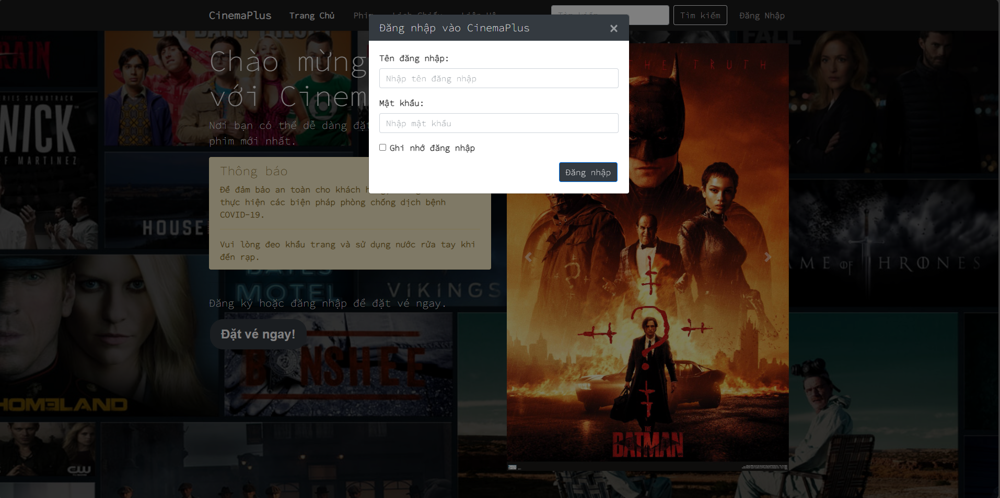
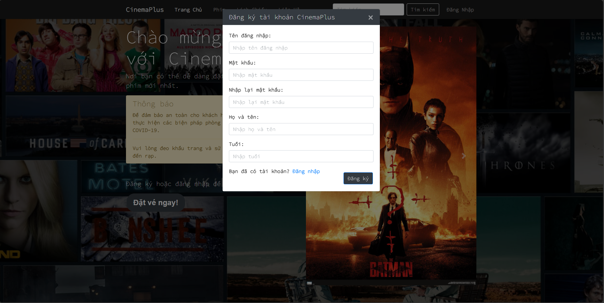
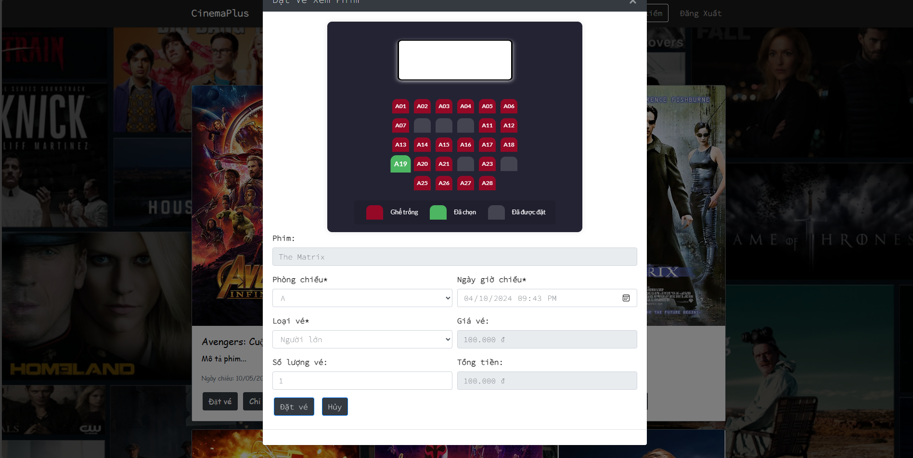
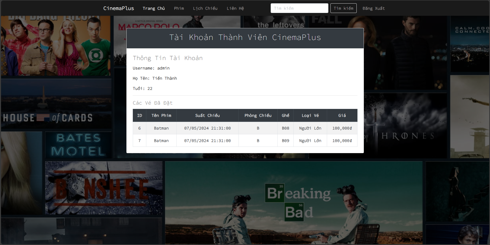
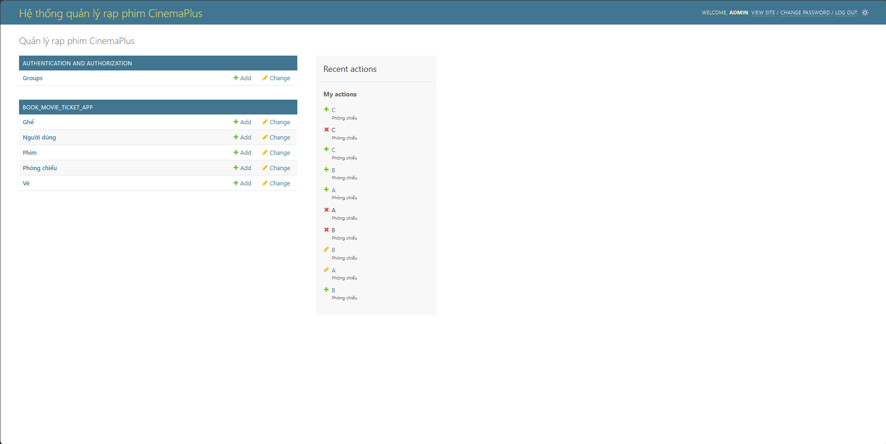

# Giới thiệu về dự án

Dự án "Đặt Vé Xem Phim Online" là một ứng dụng web đơn giản được phát triển bằng framework Django, nhằm mục đích cung cấp một nền tảng thuận tiện cho người dùng để đặt vé xem phim trực tuyến một cách dễ dàng và linh hoạt. Dự án tập trung vào việc cung cấp trải nghiệm người dùng tốt nhất từ việc tìm kiếm phim đến việc mua vé và đặt chỗ.

## Các chức năng chính

- **Đặt vé xem phim**: Người dùng có thể chọn phim, chọn suất chiếu, chọn ghế ngồi và mua vé ngay trên ứng dụng web.

- **Quản lý phim**: Admin có thể thêm, sửa, xóa phim từ hệ thống.

- **Quản lý người dùng**: Admin có thể thêm, sửa, xóa người dùng từ hệ thống.

- **Quản lý vé xem phim**: Admin có thể xem thông tin chi tiết về vé xem phim đã được đặt.

- **Quản lý phòng chiếu và chỗ ngồi**: Admin có thể thêm, sửa, xóa phòng chiếu và chỗ ngồi từ hệ thống.

## Cài đặt

1. Clone repository:

```bash
git clone https://github.com/ptthanh02/Simple_Movie_Booking_Django.git
```

2. Cài đặt môi trường ảo:

```bash
python -m venv ten_env
```

3. Kích hoạt môi trường ảo:

```bash
ten_env\Scripts\activate
```

4. Cài đặt các thư viện cần thiết:

```bash
pip install -r requirements.txt
```

5. Di chuyển vào thư mục `book_movie_ticket`:

```bash
cd .\book_movie_ticket\
```

6. Chạy server:

```bash
python manage.py runserver
```

7. Truy cập vào trình duyệt và vào địa chỉ:

```bash
http://localhost:8000/
```

## Tài khoản admin

- **Username**: admin

- **Password**: 123

## Các hình ảnh minh họa

1. Trang chủ:



2. Đăng nhập:



3. Đăng ký:



4. Trang danh sách phim:


5. Trang đặt vé:



6. Trang danh sách vé đã đặt:



7. Trang admin quản lý hệ thống:



## Công nghệ sử dụng

- **Frontend**: HTML, CSS, Bootstrap, JavaScript, jQuery

- **Backend**: Python, Django

- **Database**: SQLite


